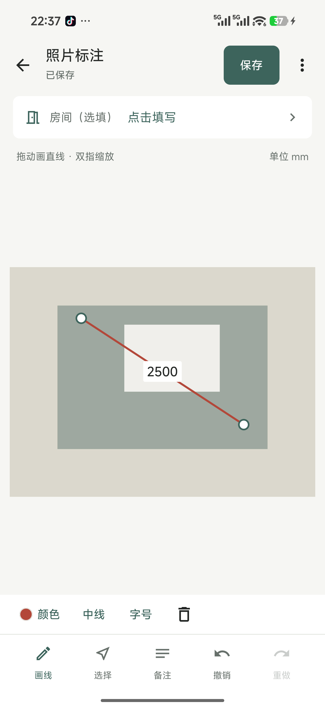

# MeasurePhoto · 现场量尺

[](https://github.com/Lsama666/measure-photo/actions/workflows/android.yml)
[](LICENSE)

An offline Android tool for recording **manually measured dimensions on site photos**, then exporting annotated images and PDFs. Built with Kotlin, Jetpack Compose, Room and CameraX. Android 10+; current UI is Simplified Chinese.

**Photos do not measure real-world dimensions.** Enter values measured with a tape or laser. Changing a value does not rescale the drawn line.

Early-stage, newly public project maintained by [Lsama666](https://github.com/Lsama666). No claim of broad adoption, download volume or production certification. Version: 0.2.1.

## What works

- Create projects; capture or import photos; optionally label rooms and notes.
- Draw dimension lines, snap shared endpoints, drag labels, zoom, undo and redo.
- Keep original photos separate from annotations; save editing data locally.
- Export annotated images through MediaStore and a multi-page PDF.
- No account, server, analytics SDK, advertising or INTERNET permission in the application manifest.

The intended users are installers, interior designers and small workshop teams who need portable site records. The reusable engineering work includes normalized geometry, label placement, EXIF-aware rendering, shared endpoints and bounded-memory batch export.

## Build and test

Clone into a local, non-synced directory. Install JDK 17 and Android SDK Platform 35 / Build Tools 35.0.0. Set `ANDROID_HOME` (or an untracked `local.properties` with `sdk.dir`).

```sh
./gradlew assembleDebug testDebugUnitTest lintDebug assembleDebugAndroidTest
```

On Windows use `gradlew.bat`. Gradle 8.11.1 is downloaded and checksum-verified by the wrapper. AGP is pinned to 8.9.2, Kotlin to 1.9.25 and Compose compiler to 1.5.15. Network access is required to obtain build dependencies; the app itself runs offline.

The APK is at `app/build/outputs/apk/debug/app-debug.apk`. CI publishes a debug APK and test reports as workflow artifacts. These require GitHub sign-in to download. Debug builds are for evaluation, not an app-store release, and signing keys may differ across CI runs.

Device tests on a disposable test device/emulator:

```sh
./gradlew connectedDebugAndroidTest
```

The 100-photo load test is opt-in; see [testing](docs/TESTING.md). Do not use private client photos in bug reports.

## Preview and current limits



This is a **historical v0.1.0 device screenshot**, using synthetic test imagery. In v0.2.1 the white label background has been removed and label placement/interaction changed. It is not a screenshot of the current build.

Review [verification and remaining gaps](docs/TESTING.md) before relying on the app. No iOS release. Large-batch PDF images are downsampled to control memory; dimensions remain vector text/lines. Full manual device coverage, interrupted-export recovery and older/low-memory phones remain open work.

## Contributing

See [CONTRIBUTING.md](CONTRIBUTING.md), [roadmap](docs/ROADMAP.md) and [security policy](SECURITY.md). Contributions in Chinese or English are welcome. Maintainer reviews all proposed changes. AI assistance may be used, but generated changes still need tests and review.

## 中文说明

给现场照片记录实测尺寸，导出图片和 PDF。新建项目 → 拍照或导入 → 画线 → 填写毫米数 → 保存 → 导出。尺寸必须自行测量；照片不能自动推算真实长度。当前为早期 Android 测试版，无账号、云端或应用内联网功能。完整测试边界见 [测试说明](docs/TESTING.md)。

## License

Project code is released under the [MIT License](LICENSE). Dependencies retain their own licenses; see [third-party notices](THIRD_PARTY_NOTICES.md).
